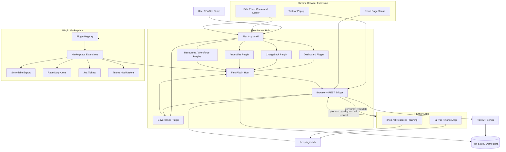
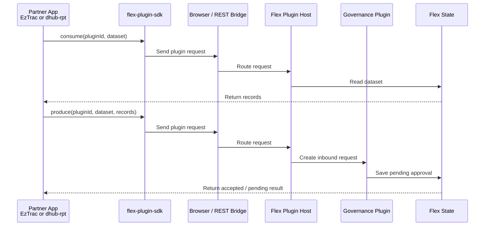

# Flex Access Hub 30-Minute Demo Script

This is the script to use during the live demo. It is written in simple presenter language.

The demo has one main message:

> Flex Access Hub is a FinOps command center that uses plugins so Flex, partner apps, and marketplace extensions can safely exchange data through one governed API.

## The Simple Explanation

Use these definitions throughout the demo.

| Word | Simple meaning |
| --- | --- |
| Flex | The main FinOps command center |
| Plugin | A feature with a contract |
| Contract | What the plugin can read, send, and expose |
| Consume | Read data from Flex |
| Produce | Send data into Flex |
| Governance | Approval, audit, and control before data becomes trusted |
| Marketplace | Where apps install plugin capabilities |
| Partner app | External app that connects to Flex, such as EzTrac or dhub-rpt |

Important line to repeat:

> A plugin is not only a page. A plugin is a contract: ID, datasets, permissions, consume actions, produce actions, and optional UI.

## Architecture Diagrams

There are two diagrams for two different moments in the demo.

| Diagram | When to use it | What it explains |
| --- | --- | --- |
| Diagram 1: System map | Use this in the main architecture section | What components exist and how they relate |
| Diagram 2: Request flow | Use this only if someone asks how the API call works | What happens during consume and produce |

If you are short on time, show only Diagram 1. Diagram 2 is optional.

## Diagram 1: System Map

Use this diagram when you explain the system from zero.

Say this before showing it:

> This diagram is the full system map. It shows Flex in the center, partner apps on one side, marketplace extensions on another side, and the plugin host/API in the middle.



### What To Say For Diagram 1

Say this:

> Start in the middle. Flex is the main command center.

> Inside Flex, the main features are plugins: Dashboard, Governance, Chargeback, Anomalies, Resources, and Workforce.

> The plugin host is the gatekeeper. It receives plugin calls and routes them to the correct plugin.

> Partner apps like EzTrac and dhub-rpt do not directly touch Flex internals. They use `flex-plugin-sdk`.

> Marketplace extensions like Snowflake, PagerDuty, Jira, and Teams are optional plugins that can be installed.

> The Chrome browser extension is another host surface. It gives users quick access to Flex from the browser toolbar, side panel, and cloud console pages.

> Everything uses the same plugin model: catalog, consume, and produce.

> Consume means reading data from Flex. Produce means sending data into Flex. Governed produce actions land in the Governance plugin as inbound requests.

### The One Sentence For Diagram 1

Use this if you get stuck:

> Flex is the host, plugins are the capabilities, partner apps use the SDK, marketplace adds optional extensions, and governance controls incoming data.

## Diagram 2: Request Flow

Use this smaller diagram only if the audience asks, "What actually happens when EzTrac clicks a button?"

Say this before showing it:

> The first diagram showed where things live. This second diagram shows one request moving through the system.



### What To Say For Diagram 2

Say this:

> The read path is consume. The partner asks for a dataset, and Flex returns records.

> The write path is produce. The partner sends records, but Flex turns that into a governed inbound request instead of blindly changing trusted data.

### The One Sentence For Diagram 2

Use this if you get stuck:

> Consume returns records. Produce creates a governed request.

## Browser Extension: Why It Exists

The browser extension is not required to understand the plugin architecture, but it is useful in the demo because it shows Flex can run outside the normal web app.

### Simple Explanation

Say this:

> The browser extension is an extra host for Flex. It brings Flex closer to where cloud engineers already work, like AWS, Azure, or GCP console pages.

### What The Browser Extension Does

| Extension part | Use |
| --- | --- |
| Toolbar popup | Quick view of KPIs, pending approvals, and shortcuts |
| Side panel | Full Flex command center inside the browser side panel |
| Page Sense | Reads cloud console context and shows relevant Flex signals |
| Plugin API buttons | Runs the same consume/produce-style actions from the browser |

### What To Say In The Demo

Say this:

> The browser extension is not a separate product architecture. It is another surface for the same Flex platform.

> The normal web app is the full command center. The browser extension is a convenience layer for cloud console workflows.

> For example, if an engineer is already in AWS or Azure, they can open the Flex extension side panel, see cost context, jump to approvals, or run plugin actions without leaving the browser.

### When To Show It

Only show the browser extension if you have extra time or if the audience asks about it.

If you show it, do this:

1. Open the Chrome extension popup.
2. Point to KPIs and shortcuts.
3. Open the side panel.
4. Say it is the same Flex command center in a browser-native host.
5. Mention Page Sense for cloud console context.

### One Sentence Summary

> The browser extension proves Flex is cross-host: web app, side panel, popup, partner apps, and API clients can all use the same platform idea.

## Full Architecture Explanation

Use this section if you need to explain the complete architecture in detail.

### 1. Big Picture

Say this:

> Flex Access Hub is built like a platform, not like one fixed dashboard.

> The main Flex app is the host. Every major capability is modeled as a plugin. Partner apps and marketplace extensions talk to Flex through the same plugin API.

The architecture has six main parts:

| Part | What it does |
| --- | --- |
| Flex App Shell | The main UI where users work |
| Flex Plugin Host | The runtime that receives plugin requests |
| Core Plugins | Built-in Flex capabilities like dashboard, governance, chargeback, anomalies |
| Marketplace Extensions | Optional add-ons like Snowflake, PagerDuty, Jira, Teams |
| Partner Apps | External apps like EzTrac and dhub-rpt |
| Browser Extension | Browser-native access through popup, side panel, and cloud page context |

Simple explanation:

> The app shell shows the product. The plugin host controls access. Plugins define capabilities. Partner apps use the SDK. The browser extension gives quick access from cloud console workflows. Governance controls incoming changes.

### 2. Flex App Shell

The Flex App Shell is the main React app.

It is responsible for:

- Showing the dashboard
- Showing navigation
- Showing pages like Governance, Chargeback, Anomalies, Resources, Workforce
- Showing plugin catalog and marketplace state
- Mounting the plugin bridge
- Connecting user actions to Flex state

Say this:

> The app shell is what users see, but it should not contain all integration logic. The integration logic belongs in plugins and the plugin host.

Example:

> The Dashboard page is visible in the app shell, but the Dashboard capability is also represented as the `flex.dashboard` plugin.

### 3. Core Plugins

Core plugins are built into Flex.

Examples:

| Core plugin | Purpose |
| --- | --- |
| `flex.dashboard` | KPI snapshot, usage trend |
| `flex.governance` | Inbound requests, published datasets, transfer log |
| `flex.chargeback` | Team showback, budgets, tag compliance |
| `flex.anomalies` | Cost incidents and anomaly actions |
| `flex.resources` | Allocation matrix |
| `flex.workforce` | Squad capacity and workforce signals |
| `flex.optimization` | Savings lifecycle |
| `flex.assistant` | AI context and knowledge |

Say this:

> Core plugins are shipped with Flex. They are part of the product, but they still follow the plugin contract model.

Each plugin declares:

- Plugin ID
- Name
- Version
- Route
- Category
- Datasets
- Whether it can consume
- Whether it can produce
- Optional permissions

Simple line:

> A core plugin gives Flex a clean internal boundary. The UI can show the feature, and external tools can use the same feature through a contract.

### 4. Flex Plugin Host

The Flex Plugin Host is the runtime boundary.

It answers three questions:

1. What plugins are available?
2. Can this plugin read this dataset?
3. Can this plugin accept this produced data?

The host exposes three main operations:

```ts
catalog()
consume({ pluginId, dataset })
produce({ pluginId, dataset, records })
```

Say this:

> The plugin host is the gatekeeper. It routes requests to the correct plugin and applies Flex rules before data is read or written.

When a partner calls consume:

1. Partner app sends plugin ID and dataset.
2. SDK sends the request to Flex.
3. Plugin host finds the plugin.
4. Plugin returns records.
5. Partner receives structured data.

When a partner calls produce:

1. Partner app sends plugin ID, dataset, and records.
2. SDK sends the request to Flex.
3. Plugin host validates the request.
4. Flex creates or applies the governed action.
5. For partner data exchange, Flex creates an inbound request.

Important line:

> The plugin host prevents partner apps from directly reaching into Flex internals.

### 5. Plugin Datasets

Datasets are the data contracts of plugins.

Examples:

| Plugin | Dataset | Meaning |
| --- | --- | --- |
| `flex.dashboard` | `kpi_snapshot` | Dashboard KPI record |
| `flex.governance` | `data_requests` | Pending and completed requests |
| `flex.governance` | `published_datasets` | Data Flex has published outward |
| `flex.chargeback` | `team_showback` | Team spend and budget data |
| `flex.anomalies` | `anomaly_events` | Cost anomaly records |
| `flex.resources` | `allocation_matrix` | Resource allocation data |
| `flex.partner.eztrac` | `inbound_request` | EzTrac sends request into Flex |
| `flex.partner.dhub-rpt` | `pull_published` | dhub-rpt pulls published data |

Say this:

> The dataset name is important because it makes integration explicit. A partner does not ask for random data. It asks for a named dataset from a named plugin.

Explain directions:

| Direction | Meaning |
| --- | --- |
| Outbound | Flex exposes data for others to read |
| Inbound | Partner sends data into Flex |
| Bidirectional | The dataset can be read and updated through controlled actions |

### 6. Consume Flow

Consume means read data from Flex.

Example:

```ts
client.consume({
  pluginId: "flex.chargeback",
  dataset: "team_showback",
});
```

What happens:

1. EzTrac asks for chargeback data.
2. SDK sends request to Flex.
3. Plugin host routes to `flex.chargeback`.
4. Chargeback plugin returns `team_showback`.
5. EzTrac displays the records.

Say this:

> Consume is safe read access through a controlled contract.

### 7. Produce Flow

Produce means send data into Flex.

Example:

```ts
client.produce({
  pluginId: "flex.partner.eztrac",
  dataset: "inbound_request",
  records: [
    {
      fromApp: "eztrac",
      dataset: "forecast_variance",
      recordCount: 500,
      purpose: "Q3 planning refresh",
    },
  ],
});
```

What happens:

1. EzTrac sends records to Flex.
2. SDK sends produce request.
3. Plugin host routes to the EzTrac partner plugin.
4. Flex creates a Governance inbound request.
5. Flex user can approve or reject.
6. Transfer log keeps history.

Say this:

> Produce does not mean uncontrolled write access. Produce means a partner sends data into the governed Flex workflow.

### 8. Governance Layer

Governance is the control point.

It handles:

- Pending inbound requests
- Approvals
- Rejections
- Published datasets
- Transfer logs
- Partner sync history

Say this:

> Governance is why this architecture is safer than direct integrations. External apps can participate, but Flex controls when data becomes trusted.

Example:

> If EzTrac sends forecast data, Flex does not instantly overwrite financial records. It creates an inbound request in Governance.

### 9. Marketplace Extensions

Marketplace extensions are optional plugins.

Examples:

| Extension plugin | Purpose |
| --- | --- |
| `flex.ext.snowflake` | Export chargeback and usage data |
| `flex.ext.pagerduty` | Trigger incidents for cost anomalies |
| `flex.ext.jira` | Create tickets from anomaly candidates |
| `flex.ext.teams` | Post messages to Teams channels |

Say this:

> Marketplace extensions let Flex grow without hardcoding every vendor integration into the core app.

Install flow:

1. Plugin appears in marketplace.
2. User installs it.
3. Installed extension becomes available.
4. If enabled, it contributes actions or data contracts.

Production note:

> In production, marketplace packages would be signed, versioned, verified, and installed per tenant.

### 10. Partner Apps

Partner apps are external applications that use Flex data.

In this demo:

| Partner app | Role |
| --- | --- |
| EzTrac | Finance forecasting |
| dhub-rpt | Resource planning |

Say this:

> Partner apps do not import Flex internals. They use `flex-plugin-sdk`.

EzTrac examples:

- Reads KPIs
- Reads chargeback data
- Sends forecast or sync requests
- Creates governed inbound requests

dhub-rpt examples:

- Reads allocation data
- Reads workforce or resource planning data
- Sends capacity or planning updates

Important line:

> The same integration model works for both partners, but each partner gets a different data surface.

### 11. SDK And Bridge

The SDK is the client library partner apps use.

Package:

```ts
flex-plugin-sdk
```

It supports:

- Same-window calls through `window.FlexPlugins`
- Same-origin browser calls through `BroadcastChannel`
- Cross-window browser calls through `postMessage`
- Tool and automation calls through REST API

Say this:

> The SDK hides the transport details. Partner apps just call catalog, consume, or produce.

Transport options:

| Transport | Used for |
| --- | --- |
| `window.FlexPlugins` | Same browser window |
| `BroadcastChannel` | Same-origin browser tabs |
| `postMessage` | Connected browser windows |
| REST API | VS Code, scripts, Node tools, partner services |

### 12. Local API Server

The local API server is the REST bridge for the demo.

It provides:

- Plugin catalog endpoint
- Consume endpoint
- Produce endpoint
- Partner marketplace endpoints
- Shared demo state

Say this:

> The API server lets non-browser tools and partner apps call the same plugin model.

Important:

> In this demo, the API server is local and simple. In production, this would be authenticated, tenant-aware, logged, monitored, and backed by a real database.

### 13. State And Data Storage

In the demo, state is mock/demo state.

It may live in:

- Browser local storage
- Local API runtime state
- Seed JSON files

Say this:

> The data is mock data for demonstration. The architecture is what matters. In production, the same plugin contracts would connect to real data sources like cloud billing, finance systems, planning tools, ticketing tools, and databases.

Production data sources could include:

- AWS Cost and Usage Reports
- Azure Cost Management
- GCP Billing Export
- Snowflake
- Jira
- PagerDuty
- Finance planning systems
- Resource planning systems

### 14. Security Boundary

Say this carefully:

> The demo shows the correct architecture shape, but production needs stronger security.

Production hardening:

- User authentication
- Service account authentication
- Tenant authorization
- Server-side permission checks
- Strict browser origin allowlists
- Signed plugin packages
- Checksum verification
- Audit logs
- Rate limits
- Monitoring
- Sandboxed plugin execution

Important line:

> The current demo proves the plugin model. Production would harden the trust boundary.

### 15. Full Architecture Summary

Use this as the final architecture explanation:

> Flex is the host. Core plugins provide built-in FinOps capabilities. Marketplace extensions add optional integrations. Partner apps use the SDK to call the plugin API. The plugin host routes catalog, consume, and produce requests. Governance controls inbound changes. The API server and browser bridge provide transport. This lets Flex stay the governed system of control while still allowing external apps to participate.

## What To Run Before The Demo

Run this before the meeting starts:

```bash
npm run dev:all
```

Open these tabs:

| Tab | URL | What it is for |
| --- | --- | --- |
| Flex | http://localhost:5173/ | Main product demo |
| API | http://localhost:3847/ | Shows backend bridge is running |
| Marketplace | http://localhost:5176/ | Shows app/plugin install flow |
| EzTrac | http://localhost:5174/ | Finance partner app |
| dhub-rpt | http://localhost:5175/ | Resource planning partner app |

If Flex opens on another port, use the port from the terminal.

## 30-Minute Demo Plan

| Time | Section | Screen |
| --- | --- | --- |
| 0:00-2:00 | What this is | Flex Dashboard |
| 2:00-5:00 | The business problem | Flex Dashboard |
| 5:00-8:00 | Plugin architecture | Flex Plugins or README |
| 8:00-12:00 | Dashboard walkthrough | Flex Dashboard |
| 12:00-16:00 | Governance walkthrough | Governance / Data Exchange |
| 16:00-20:00 | Plugin catalog | Plugins page |
| 20:00-23:00 | Marketplace | Marketplace app |
| 23:00-27:00 | EzTrac partner flow | EzTrac then Flex Governance |
| 27:00-29:00 | dhub-rpt partner flow | dhub-rpt |
| 29:00-30:00 | Final close | Flex Dashboard or Plugins |

Do not try to click every feature. The goal is to explain the system clearly.

---

# 0:00-2:00 - Opening

## Do This

Open the Flex Dashboard.

## Say This

> Today I am showing Flex Access Hub. It is a FinOps command center, but the important part is not only the dashboard. The important part is the plugin architecture.

> Flex lets internal modules, marketplace extensions, and partner apps exchange data using the same plugin API.

> The three things I will show are: first, Flex as the main command center; second, plugin-based governance; and third, partner apps like EzTrac and dhub-rpt using Flex through plugin contracts.

## Key Point

Flex is the control center. Plugins are how other capabilities connect to it.

---

# 2:00-5:00 - The Problem

## Do This

Stay on the Dashboard. Point to cost, usage, approvals, and anomalies.

## Say This

> In real companies, cloud cost data is not in one place. Finance has forecasting tools. Platform has cloud tools. Resource planning has its own system. Incident teams use tools like PagerDuty, Teams, Jira, or Snowflake.

> The problem is that every tool wants data from every other tool. If we build one custom integration for every pair of systems, the architecture becomes hard to maintain.

> The bigger problem is governance. If an outside app directly changes Flex data, we lose approvals, audit history, permissions, and control.

> Flex solves this by making integrations plugin-based. A partner app can read or send data, but only through an installed plugin contract.

## Simple Example

Say:

> EzTrac can ask Flex for chargeback data. That is consume. EzTrac can send forecast data back to Flex. That is produce. But the produced data goes through governance before Flex treats it as trusted.

---

# 5:00-8:00 - Architecture From Zero

## Do This

Open the Plugins page, or keep Flex visible and explain verbally.

## Say This

> The architecture has three layers: Core, App, and Plugins.

> Core is the framework. It has the plugin host, plugin types, SDK, browser bridge, and REST API.

> App is the Flex shell. It wires everything together and shows routes, navigation, pages, and marketplace state.

> Plugins are the actual capabilities. Dashboard is a plugin. Governance is a plugin. Chargeback is a plugin. EzTrac connector is a plugin. Snowflake export is a plugin.

## Plugin Types

Say:

> There are three plugin types.

| Type | Explain it like this | Examples |
| --- | --- | --- |
| Core plugin | Built into Flex | Dashboard, Governance, Chargeback, Anomalies |
| Partner plugin | Contract for external apps | EzTrac, dhub-rpt |
| Extension plugin | Marketplace add-on | Snowflake, PagerDuty, Jira, Teams |

## Important Technical Line

Say:

> Every plugin has an ID. For example, dashboard is `flex.dashboard`, governance is `flex.governance`, EzTrac is `flex.partner.eztrac`, and Snowflake is `flex.ext.snowflake`.

Then say:

> The API is simple: catalog, consume, and produce.

```ts
catalog();
consume({ pluginId, dataset });
produce({ pluginId, dataset, records });
```

Explain:

> Catalog tells us what plugins exist. Consume reads data. Produce sends data into a governed workflow.

---

# 8:00-12:00 - Dashboard Walkthrough

## Do This

Go to Flex Dashboard.

Show:

- KPIs
- Spend or cost trend
- Utilization
- Pending approvals
- Anomalies
- Quick links or hub cards

## Say This

> This is the Flex command center. It gives teams one place to see cost, utilization, anomalies, approvals, and planning signals.

> In a normal app, this would just be a dashboard page. In this architecture, Dashboard is also a plugin contract.

> The dashboard plugin can expose a dataset called `kpi_snapshot`. Other tools can consume that dataset instead of scraping the UI.

## Example To Say

```ts
client.consume({
  pluginId: "flex.dashboard",
  dataset: "kpi_snapshot",
});
```

Then say:

> That gives another app structured KPI data from Flex.

## Why It Matters

Say:

> The UI and the integrations are based on the same product model. That makes Flex easier to extend.

---

# 12:00-16:00 - Governance Walkthrough

## Do This

Go to Governance / Data Exchange.

Show:

- Pending requests
- Published datasets
- Transfer log
- Approve/reject buttons if visible

## Say This

> This is the most important part of Flex Access Hub: governed data exchange.

> External apps do not directly write trusted data into Flex. They submit data through a plugin. Flex creates an inbound request. Then Flex users can review, approve, reject, and audit it.

> This is how Flex stays the system of control.

## Explain Consume And Produce Here

Say:

> Consume means a partner reads data from Flex.

> Produce means a partner sends data into Flex.

> But produce does not mean uncontrolled write access. For governed data, produce creates a request that Flex can approve or reject.

## Example

Say:

> If EzTrac sends a forecast variance, Flex creates an inbound request. If dhub-rpt sends a capacity update, Flex can route that through the same governance layer.

## Key Point

Say:

> This gives us partner integration without losing approval control.

---

# 16:00-20:00 - Plugin Catalog

## Do This

Go to the Plugins page.

Show the list of plugins.

## Say This

> This is the plugin catalog. It shows the capabilities available in this Flex instance.

> Some plugins are core Flex features. Some are partner contracts. Some are marketplace extensions.

## Point To Examples

Use these examples while pointing at the screen:

| Plugin | Explain it |
| --- | --- |
| `flex.dashboard` | Dashboard KPIs and usage trend |
| `flex.governance` | Approvals, requests, published datasets |
| `flex.chargeback` | Team showback and budget data |
| `flex.anomalies` | Cost incidents and anomaly actions |
| `flex.partner.eztrac` | Finance partner contract |
| `flex.partner.dhub-rpt` | Resource planning partner contract |
| `flex.ext.snowflake` | Export data to warehouse |
| `flex.ext.pagerduty` | Create incident from cost anomaly |
| `flex.ext.jira` | Create ticket from anomaly |
| `flex.ext.teams` | Post governance or anomaly messages |

## Say This

> This is similar to extension models in mature platforms. VS Code has extensions. Backstage has plugins. Browser platforms have extensions. Flex uses the same idea for FinOps and governed data exchange.

## If You Show Enable/Disable

Say:

> Install means the plugin is available. Enable means the plugin is active. Those are separate lifecycle states.

---

# 20:00-23:00 - Marketplace

## Do This

Open the Marketplace tab.

If there is a target app selector, choose EzTrac first.

Show installable or installed plugins.

## Say This

> This is the marketplace view. It shows how a partner app gets access to plugin capabilities.

> EzTrac does not automatically get every Flex capability. It only gets the plugin contracts that are published and installed for EzTrac.

> This is important because a finance app and a resource planning app should not have the same data surface.

## Then Choose dhub-rpt

Say:

> dhub-rpt has a different purpose. It cares about resource allocation, workforce, capacity, and planning. So it gets a different set of plugin contracts.

## Production Note

Say:

> In this demo, marketplace state is simple. In production, this would include signed packages, versions, vendor ownership, tenant approvals, license checks, and audit logs.

---

# 23:00-27:00 - EzTrac Partner Flow

## Do This

Go to EzTrac.

Show installed plugins or available plugin actions.

## Say This

> EzTrac is a simulated finance and forecasting app. It is outside Flex, but it connects to Flex through the plugin SDK.

> EzTrac can only use the plugin contracts available to it.

## Step 1: Run A Read Action

Click a read action such as KPIs, chargeback, or pending approvals.

Say:

> This is a consume operation. EzTrac is reading structured data from Flex.

Then explain:

> For example, EzTrac can consume chargeback data from the `flex.chargeback` plugin.

## Step 2: Run A Send Action

Click a send action such as inbound request or sync.

Say:

> This is a produce operation. EzTrac is sending data to Flex.

> But Flex does not silently trust it. Flex turns it into an inbound request.

## Step 3: Go Back To Flex Governance

Show the request if visible.

Say:

> Now the request is visible in Flex Governance. A Flex user can approve, reject, or audit it.

## Key Point

Say:

> This is the real value: partner apps can participate, but Flex remains the governed system of record.

---

# 27:00-29:00 - dhub-rpt Partner Flow

## Do This

Go to dhub-rpt.

Show available actions.

## Say This

> dhub-rpt is a different kind of partner app. It is focused on resource planning instead of finance forecasting.

> It uses the same plugin SDK, but the plugins and datasets are different.

## Show A Read Or Send Action

Say:

> This shows that we do not need a totally new integration architecture for every partner. EzTrac and dhub-rpt both use the same plugin model, but each app gets the contracts it needs.

## Key Point

Say:

> The platform is reusable. The data surface is controlled per partner.

---

# 29:00-30:00 - Final Close

## Do This

Return to Flex Dashboard or Plugins page.

## Say This

> The main takeaway is that Flex Access Hub is not just a dashboard. It is a plugin platform for governed FinOps workflows.

> Core Flex features, partner apps, and marketplace extensions all use one contract model.

> Partners can consume data, produce governed requests, and install only the capabilities they need.

> Flex remains the control point for approvals, audit, cost, resources, and operational workflows.

## Real-World Honesty

Say:

> The architecture is real-world aligned. It has plugin manifests, plugin IDs, datasets, permissions, a plugin host, SDK clients, marketplace concepts, and partner contracts.

> What is still demo-grade is hardening. Production would need authentication, tenant authorization, server-side permission checks, signed plugin packages, strict browser origin allowlists, persistent registry storage, audit logs, rate limits, and monitoring.

## Final Sentence

Say:

> Instead of every tool building a custom integration, every capability becomes a plugin, every plugin has a contract, and every partner interaction goes through governance.

---

# If Someone Asks Technical Questions

## What is the API?

Say:

> The plugin API has three operations: catalog, consume, and produce.

```ts
catalog();
```

> Lists available plugins.

```ts
consume({
  pluginId: "flex.chargeback",
  dataset: "team_showback",
});
```

> Reads records from a plugin dataset.

```ts
produce({
  pluginId: "flex.partner.eztrac",
  dataset: "inbound_request",
  records: [
    {
      fromApp: "eztrac",
      dataset: "forecast_variance",
      recordCount: 500,
      purpose: "Q3 planning refresh",
    },
  ],
});
```

> Sends records into Flex through a governed plugin contract.

## How do partner apps connect?

Say:

> They use `flex-plugin-sdk`. In the browser it can use `window.FlexPlugins`, `BroadcastChannel`, or `postMessage`. External tools can use the REST API.

## Is this production-ready?

Say:

> The architecture is production-style, but this implementation is demo-grade. The production version needs auth, tenant permissions, signed packages, strict origin security, database-backed registry state, and audit logging.

## Why not just REST endpoints?

Say:

> REST endpoints only provide transport. Plugins add discovery, lifecycle, permissions, versioning, install state, marketplace visibility, and dataset contracts.

## Is Flex replacing EzTrac or dhub-rpt?

Say:

> No. Flex is the governance and command layer. EzTrac and dhub-rpt keep their own workflows, but they exchange data with Flex through plugin contracts.

---

# If Something Breaks

## If `npm run dev:all` fails

Run apps separately:

```bash
npm run dev:api
npm run dev:flex
npm run dev:marketplace
npm run dev:eztrac
npm run dev:rpt
```

## If Marketplace Does Not Work

Say:

> The marketplace is a demo registry. The important architecture is still visible in the Flex plugin catalog and the partner consume/produce flow.

## If Partner App Does Not Connect

Say:

> The partner app normally connects through the SDK and bridge. The intended flow is install plugin, consume Flex data, then produce a governed inbound request.

## If API Is Down

Say:

> The UI still demonstrates the plugin architecture. The API is the external bridge for partner apps, VS Code, and automation clients.

---

# 10-Minute Backup Version

If time gets cut short, do this:

1. Dashboard: Flex command center.
2. Governance: inbound requests and approvals.
3. Plugins: core, partner, and extension plugins.
4. Marketplace: app-specific install model.
5. EzTrac: consume and produce.
6. Close: Flex is a plugin platform, not just a dashboard.

Use this final summary:

> Flex Access Hub turns FinOps integrations into governed plugin contracts. Apps can read and send data, but Flex keeps the approval and audit boundary.
